# 🏛️ Topic Trips Guide

## 📑 Table of Contents

1. [Summary](#-summary)
2. [Project Context](#-project-context)
3. [Similar Applications](#-similar-applications)
4. [Key Differences Compared to Similar Apps](#-key-differences-compared-to-similar-apps)
5. [Motivation for Choosing the Topic](#-motivation-for-choosing-the-topic)
6. [Project Objectives](#-project-objectives)
7. [System Requirements](#-system-requirements)
8. [Requirements & Installation](#requirements--installation)
9. [Database & Data Model](#database--data-model)
10. [Architecture (MVVM)](#architecture-mvvm)
11. [Pages Overview](#pages-overview)
12. [Conclusion](#-conclusion)
13. [License](#-license)


---

## 📄 Summary

This work proposes the development of a **web application** for planning and exploring tourist routes, focusing on significant historical and culinary locations in Europe. The application allows users to create personalized routes, either based on predefined itineraries or by selecting locations from the lives of European historical figures. Each location includes detailed historical information and relevant images, with a mini wiki component for additional context.  

Users can select locations to create customized routes that include points of interest such as castles and historical battle sites. The application provides route optimization options and features for saving routes and adding reviews.

---

## 🌍 Project Context

The application addresses the need for planning tourist routes based on historical and culinary locations. Many tourists and history enthusiasts want to discover remarkable sites, and Topic Trips Guide facilitates this through:

- Predefined or customizable routes  
- Interactive maps and optimized routing  
- Integration of local culinary attractions  
- Ability to save and download routes  

**Target audience:** tourists, history enthusiasts, and food lovers.

---

## 📱 Similar Applications

### Komoot
- Outdoor route planning (hiking, cycling)  
- Includes historical points of interest and route saving  

### Yelp
- Discover restaurants and accommodations  
- Personalized recommendations based on user reviews  

### TripAdvisor
- Reviews and information about destinations, restaurants, and hotels  
- Maps, distance calculation, and booking options  

---

## 🔑 Key Differences Compared to Similar Apps

1. **Personalized route planning**  
2. **Historical and cultural routes**  
3. **User interaction and personalized feedback**  
4. **Focus on local gastronomy**  
5. **Interactive maps and optimized navigation**

---

## 🎯 Motivation for Choosing the Topic

The topic was chosen due to a passion for **history and travel**, combining exploration of historical sites with gastronomy. The project allowed the development of an interactive web application that provides valuable information and facilitates efficient trip planning.

---

## 📝 Project Objectives

- User authentication system to save routes and preferences  
- Predefined routes for historical figures and culinary cities  
- Route customization by users  
- Location details: images, descriptions, historical information  
- Integration with OpenRouteService and OpenStreetMap APIs  
- Collection of user feedback and reviews  
- Route saving and PDF export  
- Route visualization with estimated distances  

---

## 💻 System Requirements

### Functional
- User authentication  
- Viewing and customizing routes  
- Interactive maps and routing API  
- Save and download routes  
- Feedback and reviews for locations

### Non-Functional
- Protection of user data  
- Performance and support for multiple simultaneous users  
- Intuitive and appealing interface  
- High availability

---

## Requirements & Installation

To run Topic Trips Guide, your system must meet the following requirements and follow the installation steps.

### 🖥️ System Requirements
- Windows 10 or higher (or any OS supporting .NET 8.0)  
- Modern web browser (Chrome, Edge, Firefox, Safari)

### 💻 Development Tools
- Visual Studio 2022 Community Edition  
- .NET SDK 8.0

### 🗄️ Database
- MySQL server installed and running  
- Optional: SQLite for local testing/development

### 📦 NuGet Packages / Dependencies
- Microsoft.AspNetCore.Identity.EntityFrameworkCore 8.0.11  
- Microsoft.AspNetCore.Identity.UI 8.0.11  
- Microsoft.EntityFrameworkCore.Sqlite 8.0.11  
- Microsoft.EntityFrameworkCore.SqlServer 8.0.11  
- Microsoft.EntityFrameworkCore.Tools 8.0.11  
- Microsoft.VisualStudio.Web.CodeGeneration.Design 8.0.7  
- Pomelo.EntityFrameworkCore.MySql 8.0.3  
- QuestPDF 2025.5.0  
- System.Text.Json 8.0.5

### 🌐 API / Services
- OpenRouteService API key for route calculations  
- Access to OpenStreetMap data for interactive maps

### 🛠️ Installation Instructions

1. **Clone the repository**  
```bash
git clone https://github.com/yourusername/Topic-Trips-Guide.git
cd Topic-Trips-Guide
```
2. **Configure database connection**

Copy ```appsettings.example.json``` to ```appsettings.json```

Update connection strings for MySQL / SQLite

3. **Apply database migrations**

First, create the migration (if not already created):

```bash
dotnet ef migrations add InitialCreate
```

Then apply the migration to the database:

```bash
dotnet ef database update
```

4. **Run the application**

```bash
dotnet run
```

5. **Access the app in your browser**

```http://localhost:5000```

### ⚠️ Notes

Ensure MySQL server is running before applying migrations.

```InitialCreate``` migration sets up all the required tables for the application.

---

## Database & Data Model

The application uses MySQL to store information about users, routes, locations, images, themes, and reviews.

## Entities

### User
- Attributes: `id_user`, `name`, `email`, `password`, `registration_date`
- Semantic Key: `email`

### UserRole
- Attributes: `id`, `user_id`, `role_id`
- Semantic Key: `user_id * role_id`

### Role
- Attributes: `id`, `name`
- Semantic Key: `name`

### Route
- Attributes: `id_route`, `route_name`, `description`, `estimated_duration`, `creation_date`, `user_id`, `theme_id`
- Semantic Key: `route_name`

### Theme
- Attributes: `id_theme`, `name`, `type`, `creation_date`
- Semantic Key: `name`

### Location
- Attributes: `id_location`, `name`, `location_type`, `description`, `estimated_time`, `geolocation`, `street`, `street_number`, `city_id`
- Semantic Key: `name * geolocation`

### City
- Attributes: `id_city`, `name`, `country_id`
- Semantic Key: `name * country_id`

### Country
- Attributes: `id_country`, `name`
- Semantic Key: `name`

### Image
- Attributes: `id_image`, `image_name`, `path`, `location_id`
- Semantic Key: `location_id * image_name`

### Review
- Attributes: `id_review`, `review_code`, `review_date`, `comment`, `rating`, `user_id`, `location_id`
- Semantic Keys: `review_code`, `user_id * location_id * review_date`

### LocationTheme
- Attributes: `id_location_theme`, `location_id`, `theme_id`
- Semantic Key: `location_id * theme_id`

### Itinerary
- Attributes: `id_itinerary`, `date`, `order_number`, `location_theme_id`, `route_id`
- Semantic Key: `route_id * location_theme_id * order_number`


---

## Architecture (MVVM)

### 🏗️ General Architecture

The Topic Trips Guide application follows a Client–Server architecture, typical for modern web systems:

   - Client (Frontend): built with HTML, CSS, JavaScript, and Leaflet for interactive maps.
   - Server (Backend): developed in ASP.NET Core with Razor Pages, handling logic, authentication, routes, and reviews.
   - Database: uses MySQL, containing entities such as `UTILIZATOR`, `TRASEU`, `LOCATIE`, and `RECENZIE`.
   - APIs: integrates OpenRouteService for routing and OpenStreetMap for map visualization.


### 🧱 MVVM Model (Razor Pages)

The project uses the MVVM (Model–View–ViewModel) pattern provided by Razor Pages:

   - Model: defines data structures (`User`, `Traseu`, `Recenzie`, etc.)
   - ViewModel: `.cshtml.cs` files containing page logic
   - View: `.cshtml` files defining UI with Razor, HTML, CSS, JS

---

## Pages Overview

### 🔐 Login Page

The Login Page allows users to securely access their accounts in the application.
It includes validation for incorrect or empty input fields and displays appropriate error messages.

Main features:

   - Forgot Password? – lets users reset their password via an email link.
   - Remember Me – keeps the user logged in even after the session ends.

Password security is ensured through ASP.NET Identity, which automatically hashes passwords using secure encryption algorithms, preventing access to plain-text passwords even if the database is compromised.

<p align="center">
  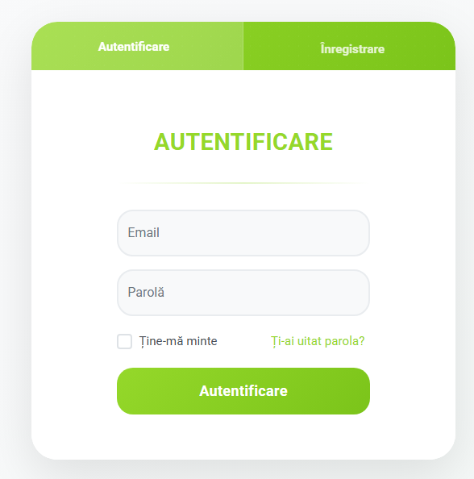
</p>

<p align="center">
  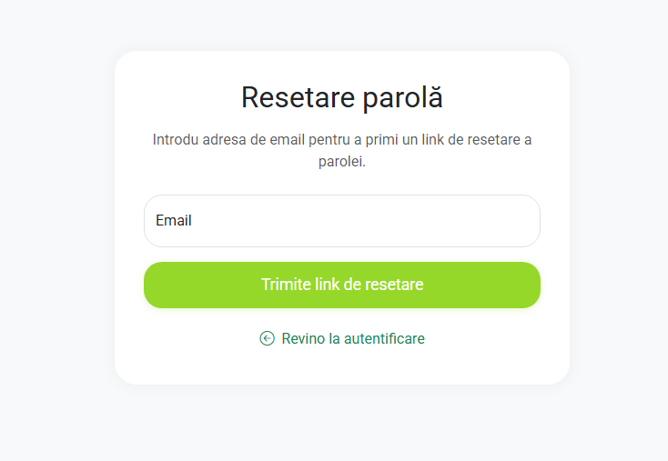
</p>

<p align="center">
  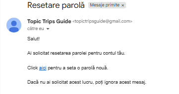
</p>

<p align="center">
  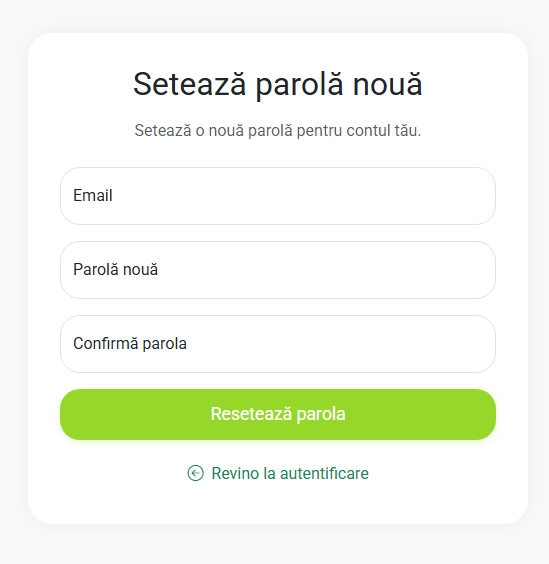
</p>

<p align="center">
  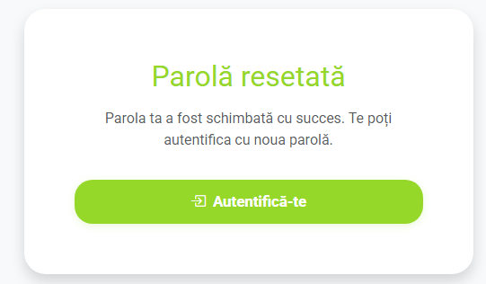
</p>

### 📝 Registration Page

The Registration Page allows users to create a new account in the application.

Error messages are displayed if any fields are incorrectly filled or left empty.

<p align="center">
  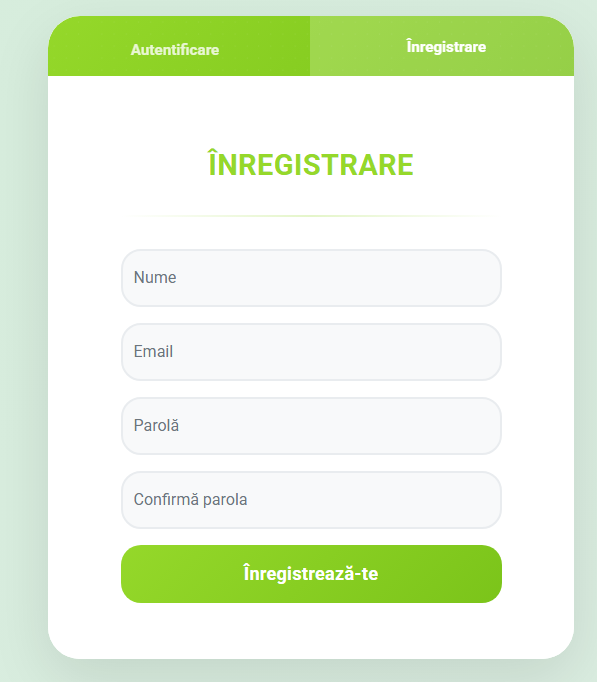
</p>


### 🏠 Main Page – TopicTripsGuide

The Main Page welcomes users with a friendly message and displays two central cards, allowing users to choose between Historical Routes and Culinary Routes.
   - Top-left navigation: Logo and app name, redirecting to the main page.
   - Top-right navigation:
        - Logout button – signs out the user.
        - Profile button – opens account details.
        - Custom Routes button – shows user’s saved routes.
        - Admin Panel button (visible to administrators) – access to management features.
   - Bottom card: Provides information about why Topic Trips Guide is a good choice.
   - Footer: Logo, app name, short description, and quick navigation links to Profile, Historical Routes, Culinary Routes, and Custom Routes.

<p align="center">
  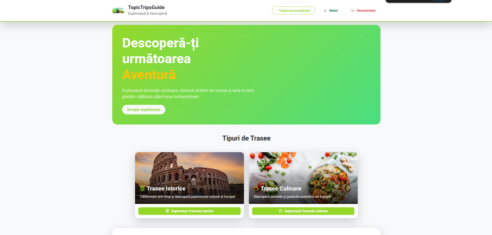
</p>

<p align="center">
  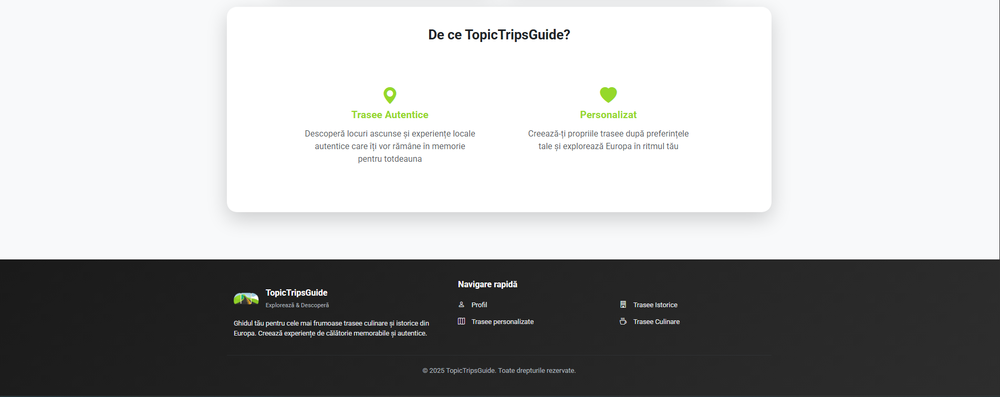
</p>

### 📜 Historical & 🍽️ Culinary Routes Pages

These pages display cards that redirect users to:
   - Predefined historical routes associated with different historical figures.
   - Thematic culinary routes highlighting local food experiences.

<p align="center">
   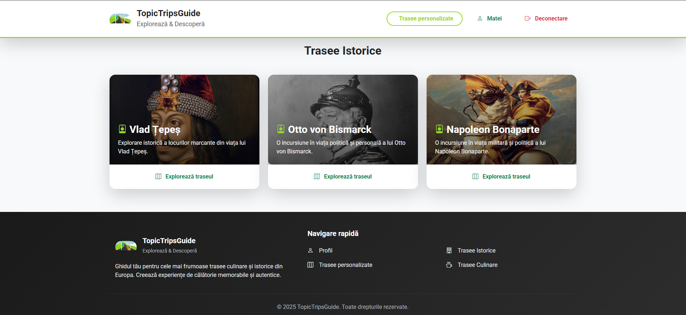
   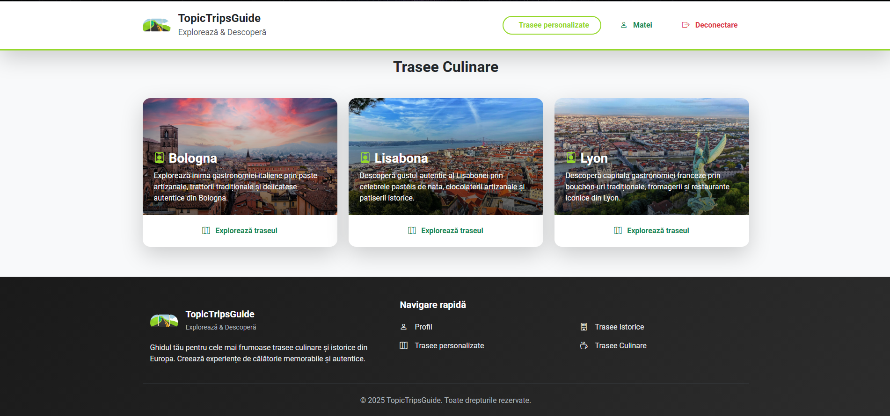
</p>

### 🗺️ Predefined Routes Page

The Predefined Routes page contains:

📝 Left Panel – Locations Card
   - Shows all locations of the selected route.
   - Each location has a Details & Reviews button opening a modal with:
        - Mini wiki description (name, address, coordinates, estimated visit time, image)
        - User reviews with star ratings
   - Admins can add, remove, or reorder locations. Removed locations go to a “Available Locations” card.
   - Users can select transport mode (car, bike, walking) to update total distance and estimated duration.
   - Admins see a Save Route button.

🗺️ Center Panel – Interactive Map
   - Locations are marked in order on the map.
   - Routes are generated automatically using the OpenRouteService API.
   - Clicking a location centers the map on it.

🔘 Bottom Buttons
   - View Full Route – resets map to show all locations.
   - Customize – create a personalized route.
   - View on Google Maps – open the route in Google Maps.
   - Download PDF – generate a PDF summary with images, mini wiki descriptions, times, and distances.

🖼️ Modal Sections
   - Mini Wiki – name, address, coordinates, description, estimated time, image.
   - Reviews – progress bar shows average rating; users can add or delete their reviews. Admins can delete all reviews if needed.

<p align="center">
   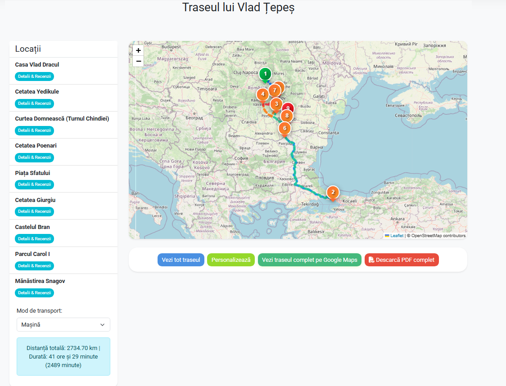
   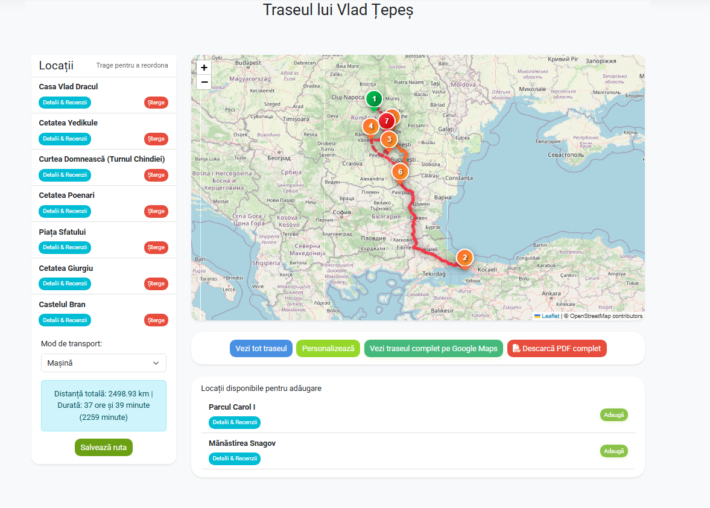
   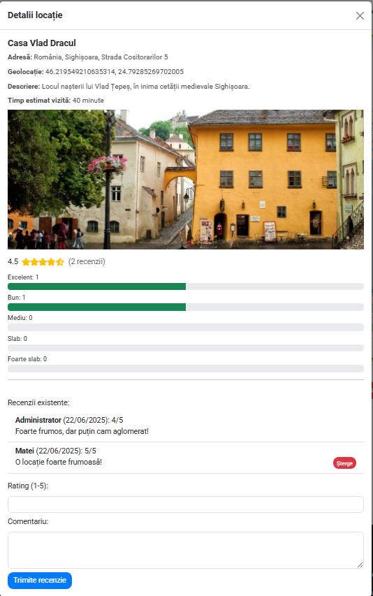
</p>

### ✨ Personalized Routes Page

The Personalized Routes page has a similar layout to the Predefined Routes page, but users can reorder or remove locations in their route.

📝 Left Panel – Locations Card
   - Shows all locations in the selected route.
   - Each location has a Details & Reviews button opening a modal with:
        - Mini wiki description (name, address, coordinates, estimated visit time, image)
        - User reviews with star ratings
   - Users can select transport mode (car, bike, walking).
   - Users can save the customized route.

🗺️ Center Panel – Interactive Map
   - Locations are connected in order using OpenRouteService API.
   - Clicking a location centers the map on it.

🔘 Bottom Buttons
   - View Full Route – resets map to show all locations.
   - View on Google Maps – open the route in Google Maps.
   - Download PDF – generates a PDF summary with images, mini wiki descriptions, times, and distances.

<p align="center">
  
</p>

### 🗂️ Your Personalized Routes Page

This page displays a card with all routes the user has created.
   - Users can view or delete their personalized routes.

<p align="center">
   
   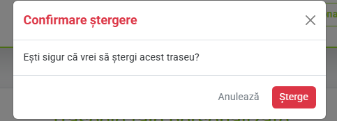
</p>

### 🛠️ Admin Panel Page

On this page, the administrator has access to two main sections:
   - Predefined Routes Section – displays cards with all predefined routes, which the admin can access to modify their content.
   - User Reviews Section – contains a card listing user reviews, redirecting the admin to the review moderation page where they can manage review content.

<p align="center">
  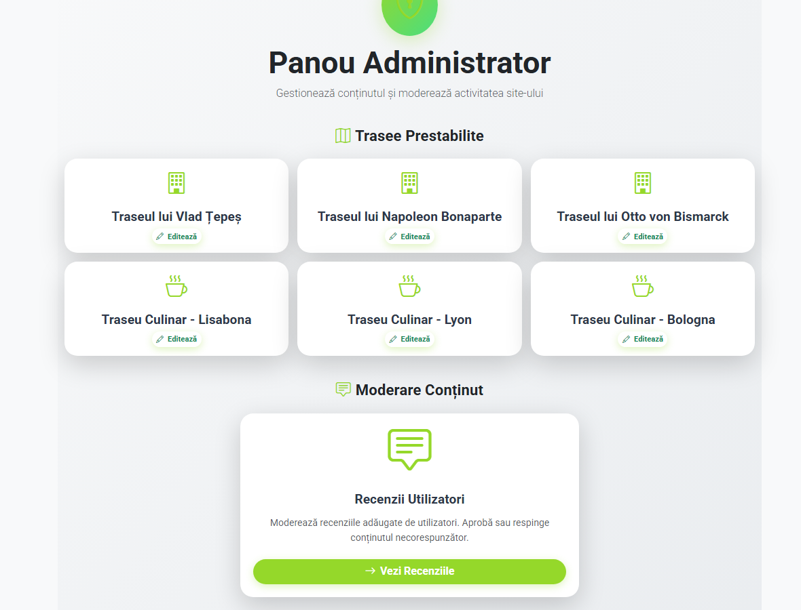
</p>

### 📝 Admin Reviews Page

On this page, the administrator can moderate user-submitted reviews.
   - Reviews are displayed in a structured table containing:
        - Location
        - User who posted the review
        - Email address
        - Rating
        - Comment
        - Date of submission
   - Each review also has a delete button for the admin to remove it if necessary.

<p align="center">
   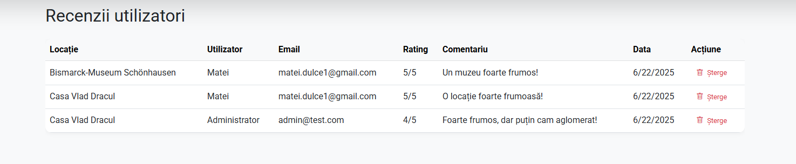
   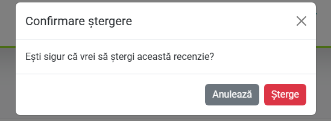
</p>

### 👤 Profile Page

This page has four sections: Profile, Email, Password, and Delete Account. Each section allows the user to view and manage their personal information.
   - Profile section:
        - Shows the current username in a card called Profile
        - User can edit their name directly in this section

<p align="center">
  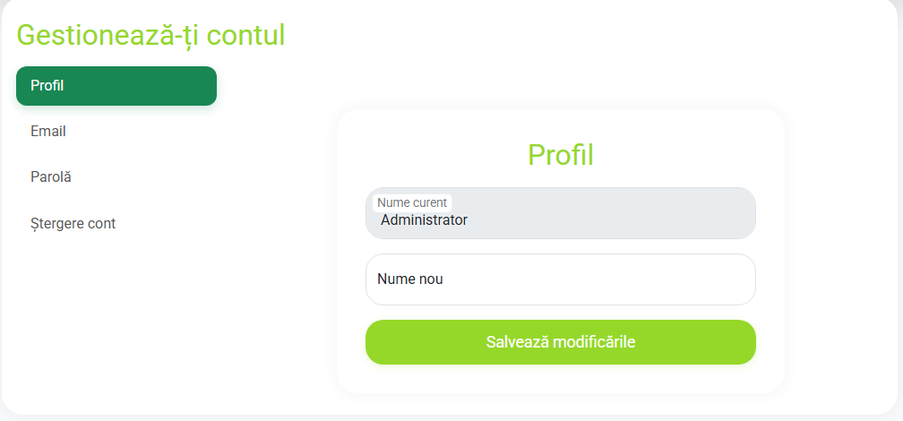
</p>

The Email section contains a card called Manage Email, which displays the user’s current email.
   - Users can change their email address.
   - If the entered email is invalid or the same as the current one, an error message is shown.

<p align="center">
   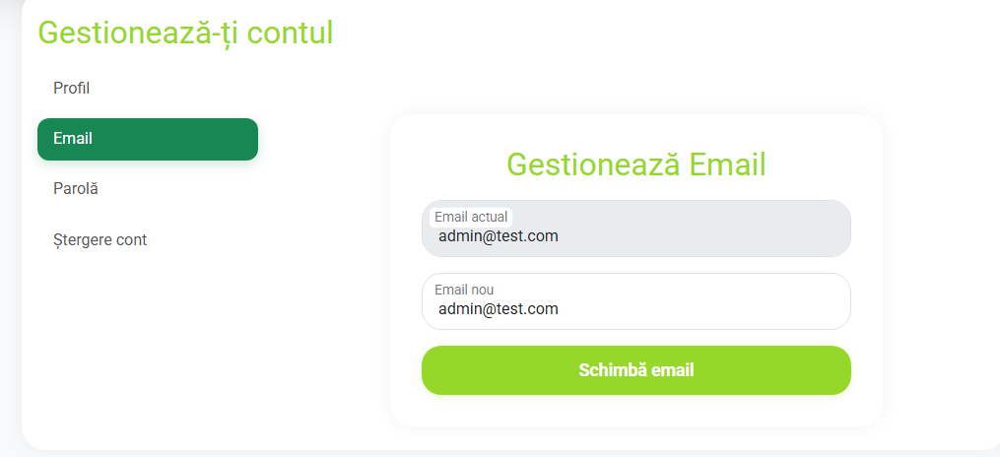
   
   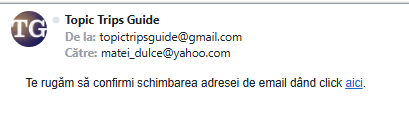
   
</p>

The Password section contains a card called Change Password, allowing the user to update their password.
   - Three fields are required: Current Password, New Password, Confirm Password.
   - If the current password is wrong, the new passwords don’t match, the new password is invalid, or any field is empty, an error message is displayed.

<p align="center">
  
</p>

The Delete Account section has a card called Personal Data, allowing the user to delete their account.
   - To confirm, the user must enter their password.
   - If the password is incorrect, an error message is displayed.

<p align="center">
   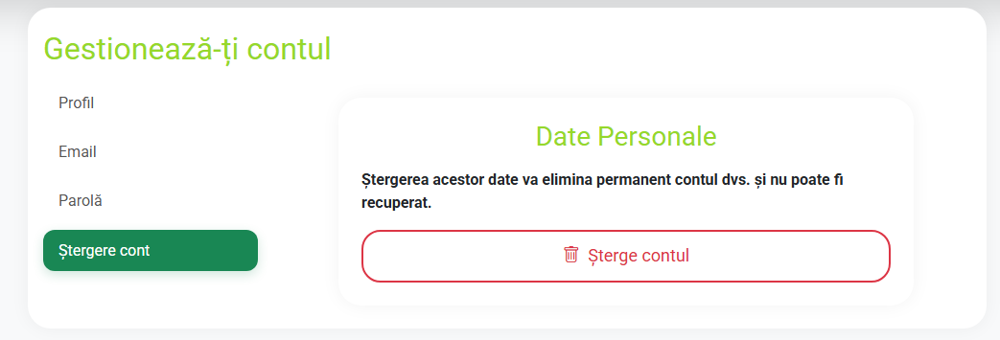
   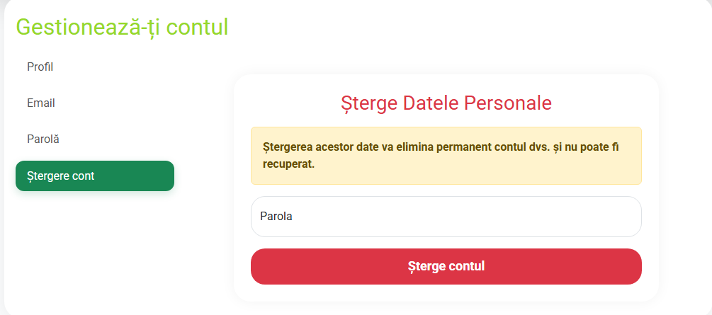
</p>

## 🏁 Conclusion

The project involved the development, implementation, and testing of Topic Trips Guide, a modern platform for users passionate about travel, history, and gastronomy.

The main goal was to provide an easy-to-use platform that allows users to:
   - Explore predefined thematic routes
   - Customize routes according to their personal preferences

Although primarily aimed at tourists, the application can also help locals discover more about their region.

Key functionalities include:
   - Historical and culinary predefined routes
   - Customizable routes, savable as PDFs
   - Interactive maps using OpenStreetMap and OpenRouteService
   - Each location includes a mini-wiki, geolocation, and user reviews
   - Admin-moderated review system for better content control

All initial project objectives were met. The most challenging part was implementing the route customization system, requiring dynamic and flexible solutions.

During development, I gained deep experience in ASP.NET Core and C#, learned to work with ASP.NET Identity for authentication, and used Leaflet and mapping APIs for the first time. I also improved my JavaScript skills and frontend-backend interaction via AJAX.

Future improvements could include:
   - More predefined routes
   - Advanced filtering options
   - Search functionality
   - Integration with a premium API plan to remove request limitations

## 📄 License

This project is licensed under the MIT License – see the [LICENSE](./LICENSE) file for details.

You are free to:
   - Use the project
   - Modify it
   - Distribute it
   - Include it in your own projects

Under the conditions specified in the LICENSE file.
